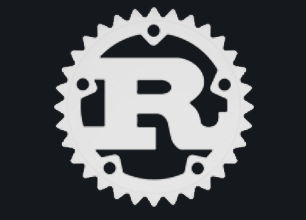

<!--   my-ticker -->    

<h2 align="center">
    

    

   
   </h2>
<h3 align="center"><i>I am a student at Penn State (Check out my <a href="https://www.linkedin.com/in/utkarsh-choudhary-a46146a4/">LinkedIn Profile</a>!)</i></h3>
I'm an aspiring developer who's passionate about all fields of technology. From computer
architecture to quantum computing to web development, I've experimented with a
lot and messed up quite a bit, but I'm nowhere near done.
I love to learn as much as I love to teach my younger brother, and even though I'm currently a
student, I hope to share what I know as much as possible. I'm also a fireship patron and a massive fan of Jeff Delaney and his work.
Take a look at some of my various projects!
<h3 align="center"><i>Check out my <a href="https://github.com/UDogg?tab=repositories">Projects</a>!</i></h3>

## ⚡ Here are some Fun facts about me.

- I love playing the synthesizer and have been playing for over 6 years. My favorite genres classical and waltz.
- I'm a big fan of science fiction and enjoy reading books and watching movies in that genre.

  

### 💾 <i>Languages, Tools, and Some Statistics!</i>
<table align="center">
    <tr>
        <th><i>Type</i></th>
        <th><i>List</i></th>
    </tr>
    <tr>
        <td><b>Languages</b></td>
        <td>
            
            
            
            
            
            
            
            
        </td>
    </tr>
    <tr>
        <td><b>Frameworks</b></td>
        <td>
            
            
            
            
            
        </td>
    </tr>
    <tr>
        <td><b>Tools</b></td>
        <td>
            
            
        </td>
    </tr>
    
<table align="center">
    <tr>
        <th><i>My GitHub Stats</i></th>
        <th><i>The Languages I Use</i></th>
    </tr>
    <tr>
        <td>
            
        </td>
        <td>
            
        </td>
    </tr>
</table>

   

  

### inspired by github.com/BEPb/BEPb
